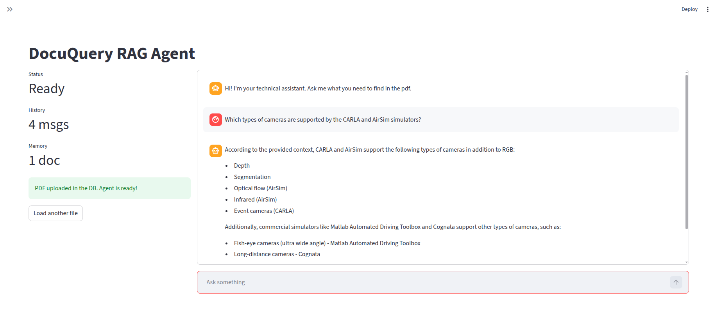

# DocuQuery RAG Agent


An on-premise RAG system designed to process and query technical documentation (PDFs). 

This project runs entirely locally using open-source LLMs. It features a microservices architecture decoupling the frontend, the API layer, and the AI reasoning engine.

## User Interface

 

## Architecture Stack

The system is fully containerized and divided into three main microservices:

* **Frontend (Streamlit):** A reactive, chat-based UI. Features dynamic state management, real-time metrics, and document ingestion.
* **Backend API (FastAPI):** Handles routing, input/output validation via Pydantic, and file uploads.
* **AI Engine (LangChain & Ollama):** 
    * **LLM:** `Llama 3 (8B)` via Ollama for local reasoning.
    * **Embeddings:** `nomic-embed-text` for semantic search.
    * **Vector DB:** `ChromaDB` for persistent local storage of chunked data.

## Key Features
* **100% Data Privacy:** Everything runs on your local network. No data ever leaves the infrastructure.
* **Microservices Design:** API and UI can be scaled or updated independently.
* **Asynchronous Ingestion:** Upload a PDF from the UI and the backend handles chunking, embedding, and database storage on the fly.
* **Conditional Rendering:** The UI adapts based on the agent's readiness state.

## Quick Start

1. **Clone the repository:**
    ```bash
    git clone https://github.com/matteoespo/docuquery-rag-agent.git
    cd docuquery-rag-agent
    ```

2. **Deploy the stack with Docker**

    ```bash
    docker-compose up -d --build
    ```

3. **Pull the local models**

    *Run inside the Ollama container:*

    ```bash
    docker exec -it docuquery-rag-ollama ollama pull llama3
    docker exec -it docuquery-rag-ollama ollama pull nomic-embed-text
    ```

## Access the Application

* **Web UI:** Navigate to http://localhost:8501 to upload a pdf and start chatting.
* **API Docs:** Navigate to http://localhost:8000/docs to test endpoints via Swagger UI.

## Roadmap & Next Steps

This project is actively evolving. The immediate next steps focus on shifting from a standard RAG pipeline to an Agentic Workflow:

* **LangGraph Integration:** Move from linear LangChain LCEL to a stateful graph architecture.
* **Query Routing:** Teach the agent to distinguish between casual greetings and technical queries (bypassing the Vector DB when unnecessary).
* **Self-Reflective RAG:** Implement a "Grader" node that evaluates retrieved documents. If the retrieved chunks are irrelevant, the agent will refuse to answer or rewrite the query instead of hallucinating.
* **Multi-Document Support:** Allow the ingestion of multiple PDFs simultaneously.
